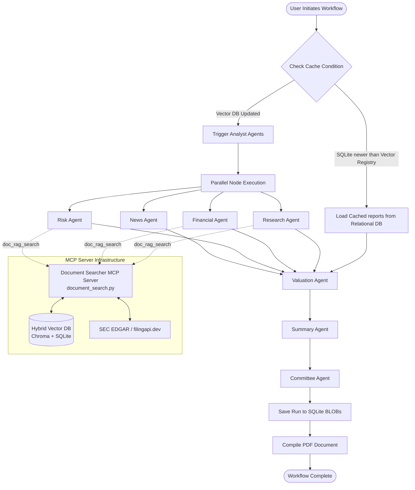
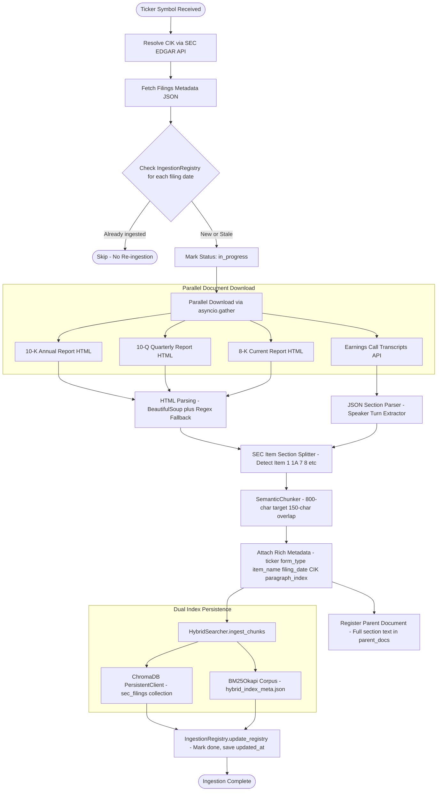
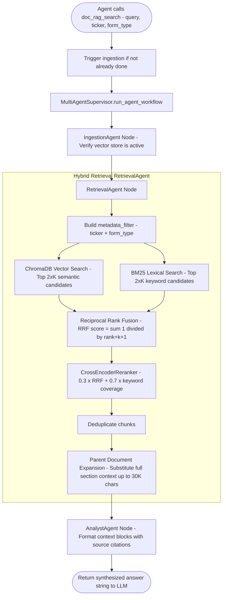
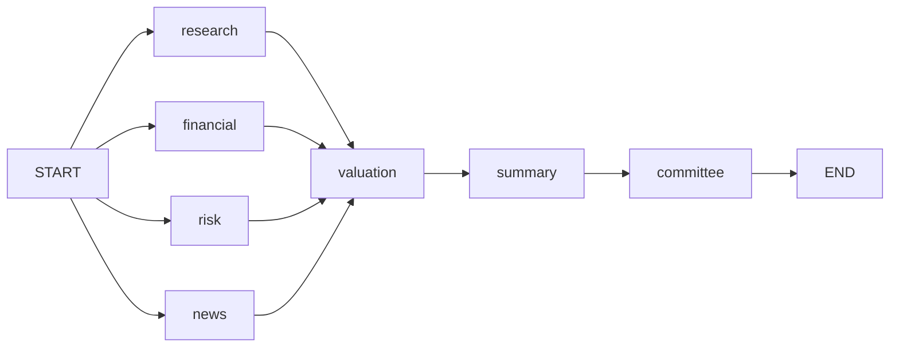
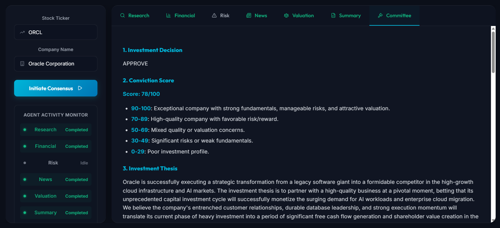
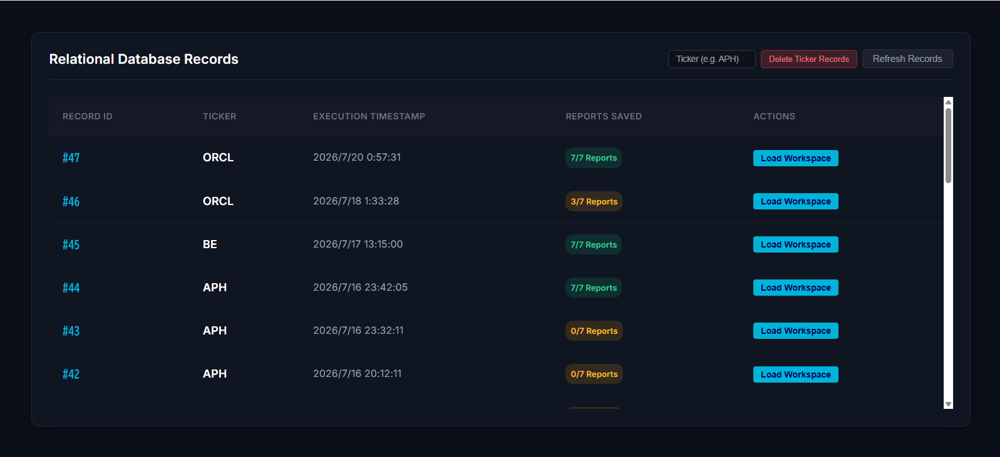
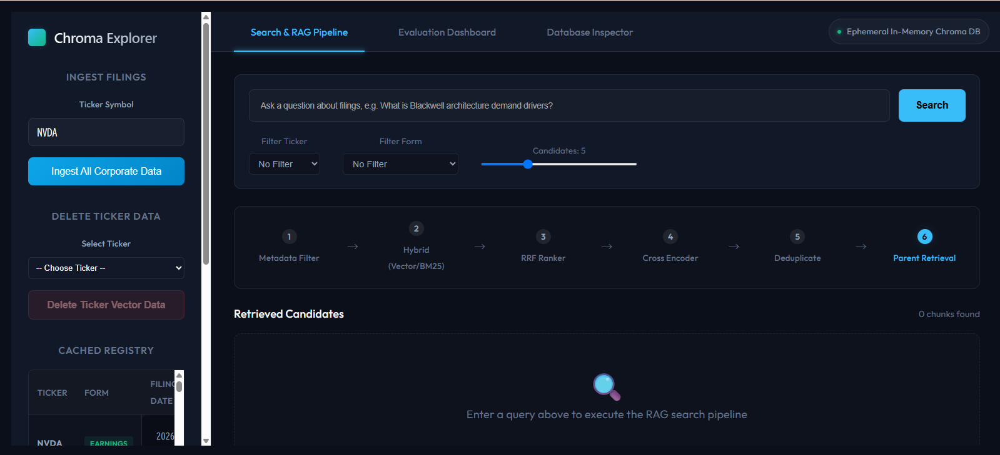

# Stock Analyst Consensus AI Suite

An AI-powered equity research platform that deploys a coordinated team of specialized financial analyst agents to produce institutional-grade investment reports for any publicly traded company.

---

## 1. Introduction

The **Stock Analyst Consensus AI Suite** is an AI-powered equity research platform that automates the work of a full investment analysis team. A user simply enters a stock ticker into the Analyst Workspace and the system takes care of the rest — sourcing the company's official financial filings and earnings call transcripts, running them through a team of specialized AI agents, and producing a complete research report with a final investment recommendation.

The application is powered by a multi-agent AI system in which each agent independently focuses on a specific dimension of the company — from business fundamentals and financial health to risk exposure, market sentiment, and valuation. The agents collaborate in a structured pipeline, with earlier agents conducting their research in parallel before passing their findings to a final set of agents that synthesize everything into a unified investment thesis and a consensus decision of Approve, Watchlist, or Reject.

The result of every run is a comprehensive research package compiled into a clean, formatted PDF downloadable directly from the workspace. Every run is also saved to a history database, allowing users to compare analyses over time as new filings and events emerge. The suite is built for individual investors, portfolio managers, and research teams who need the depth of institutional-quality equity research delivered quickly and consistently.

---

## 2. Functional Specification

*   **Analyst Workspace**: Analyse any publicly traded stock by entering its ticker symbol. The platform retrieves the company's latest official filings and earnings call transcripts, runs them through a team of specialist agents, and delivers a complete investment report.

*   **Business & Competitive Research**: Produces a qualitative profile of the company covering its business model, products and services, revenue sources, customer base, industry dynamics, total addressable market, competitive advantages, management strategy, and key growth drivers — grounded in the company's own SEC filings and earnings call transcripts.

*   **Financial Statement Analysis**: Evaluates the company's historical financial performance across multiple years and quarters, covering revenue growth, operating and net margins, return on invested capital, capital structure, debt levels, and cash flow generation — giving a clear picture of financial health and trajectory.

*   **Risk Assessment**: Identifies and ranks the material risks facing the company across company-specific, operational, legal, macroeconomic, and regulatory dimensions, drawn directly from the company's own risk disclosures and recent public filings.

*   **News & Market Sentiment**: Incorporates the latest news, analyst commentary, and market sentiment from the past 30 days alongside the fundamental analysis — surfacing recent events, earnings reactions, and narrative shifts that may affect the investment case.

*   **Valuation & Intrinsic Value Estimate**: Models the company's intrinsic value using discounted cash flow analysis across bull, base, and bear scenarios, compares the result to the current market price, and quantifies the margin of safety or premium embedded in the stock.

*   **Investment Committee Decision**: Synthesises all specialist findings into a final investment recommendation — Approve, Watchlist, or Reject — accompanied by a written thesis, conviction score, key strengths and concerns, and the conditions under which the decision should be revisited.

---

## 3. Technical Details & Architecture

### System Architecture



### Workflow Component Responsibilities

The workflow executes across two stages: a **parallel analysis stage** where four specialist components execute concurrently, and a **sequential synthesis stage** where their outputs are combined to produce a final investment decision.

#### Parallel Stage — Specialist Components

The four specialist components execute concurrently and independently. Each receives the ticker symbol and company metadata from the shared workflow context, performs its analysis, and returns a structured report upon completion.

| Component | Inputs | Responsibilities | Output |
|-----------|--------|------------------|--------|
| **Research** | Ticker, company metadata | Delegates to the **Document Searcher MCP Server** (`doc_rag_search`) to retrieve 10-K, 10-Q, 8-K filings and earnings call transcripts from the vector/hybrid store. Analyses the company's business model, products, revenue mix, customer segments, industry dynamics, TAM, competitive moat, management strategy, and growth drivers. | Qualitative business & competitive research report |
| **Financial** | Ticker, company metadata | Delegates to the **Document Searcher MCP Server** (`doc_rag_search`) to retrieve financial statement sections from SEC filings. Analyses multi-year revenue growth, gross and operating margins, net income, ROIC, capital structure, debt obligations, and free cash flow trends. | Financial performance & health report |
| **Risk** | Ticker, company metadata | Delegates to the **Document Searcher MCP Server** (`doc_rag_search`) to retrieve risk factor disclosures from SEC filings. Identifies and categorises material risks across company-specific, operational, legal, macroeconomic, and regulatory dimensions. Assigns severity to each risk. | Ranked risk exposure report |
| **News** | Ticker, company metadata | Searches the web for news, analyst commentary, press releases, and market sentiment from the past 30 days. Summarises recent developments, earnings reactions, and narrative shifts that may affect the investment case. | Real-time news & sentiment report |

#### Sequential Stage — Synthesis & Decision

After all four specialist components complete, their outputs are passed sequentially to the following components:

| Component | Inputs | Responsibilities | Output |
|-----------|--------|------------------|--------|
| **Valuation** | All four specialist reports | Builds a discounted cash flow model using assumptions derived from the specialist reports. Projects revenue, margins, and free cash flow across bull, base, and bear scenarios. Computes intrinsic value per share and compares it to the current market price to determine the margin of safety or premium. | DCF-based valuation report with scenario analysis |
| **Summary** | All five reports above | Synthesises all findings into a unified investment thesis. Distils the most important strengths, concerns, and uncertainties. Produces a quantitative conviction score (0–100) reflecting overall quality and risk-adjusted attractiveness. | Investment thesis summary with conviction score |
| **Committee** | All six reports above | Acts as the final investment board. Reviews the full body of evidence and issues a binding recommendation — **Approve**, **Watchlist**, or **Reject** — with a written rationale, risk-reward assessment, news and valuation commentary, and explicit conditions required to revisit the decision. | Final investment committee decision |

---

## 4. Document Ingestion Pipeline & Vector Database Persistence

This section details how raw SEC source documents and earnings call transcripts are fetched, parsed, chunked, embedded, and persisted into ChromaDB to serve as the knowledge base for RAG retrieval.

### 4.1 Overview

The ingestion pipeline is implemented in [`document_search.py`](app/mcp_server/document_search.py) (as part of the Document Searcher Agent MCP service). It is triggered automatically the first time a ticker is queried (via `doc_rag_search` client wrapper in `corporate_documents_search.py`) and subsequently only when new filings are detected. All form-type stages run in parallel using `asyncio.gather`.



### 4.2 Stage-by-Stage Breakdown

#### Stage 1 — CIK Resolution
`get_cik_from_ticker()` resolves the stock ticker (e.g., `NVDA`) to an SEC Central Index Key (CIK) number. It first checks a static lookup map for common tickers, then queries the SEC EDGAR Company Tickers JSON endpoint (`https://www.sec.gov/files/company_tickers.json`) for dynamic resolution.

#### Stage 2 — Filings Metadata Fetch
`SECDownloader.get_filings_metadata()` fetches the full submissions history for the resolved CIK from `https://data.sec.gov/submissions/CIK<cik>.json`. The response contains an array of every filing: accession numbers, form types, filing dates, and primary document filenames.

#### Stage 3 — Ingestion Registry Check
`IngestionRegistry` manages `vector_db_registry.json` at the project root. Before downloading any filing, the pipeline checks whether the exact `filing_date` has already been processed and marked `"done"`. If yes, it skips that filing entirely to avoid redundant work. If a prior run crashed, `reset_stale_in_progress()` cleans up lingering `"in_progress"` markers.

| Registry Field | Description |
|----------------|-------------|
| `filing_date`  | Date of the SEC filing (YYYY-MM-DD) |
| `status`       | `"in_progress"` or `"done"` |
| `updated_at`   | Timestamp of when ingestion completed |

#### Stage 4 — Parallel Download
`async_ingest_all_corporate_data()` launches four coroutines simultaneously via `asyncio.gather`:

| Coroutine | Filing Type | Source | Configurable Count |
|-----------|-------------|--------|--------------------|
| `async_fetch_and_parse()` | 10-K Annual Reports | SEC EDGAR HTML | `NUM_YEARS_TO_LOAD_10K` |
| `async_fetch_and_parse_10q()` | 10-Q Quarterly Reports | SEC EDGAR HTML | `NUM_QUARTERS_TO_LOAD_10Q` |
| `async_fetch_and_parse_8k()` | 8-K Current Reports | SEC EDGAR HTML | `NUM_DAYS_TO_LOAD_8K` |
| `async_fetch_and_parse_earnings_call()` | Earnings Transcripts | filingapi.dev JSON API | `NUM_QUARTERS_TO_LOAD_EARNINGS_CALLS` |

All count parameters are configured centrally in [`app/config.py`](app/config.py).

#### Stage 4a — Earnings Call Transcript Source (filingapi.dev)

Earnings call transcripts are fetched from **[filingapi.dev](https://filingapi.dev)** via its REST transcript endpoint. The HTTP call is isolated in the standalone function `fetch_transcripts_from_filingapi()` in [`app/mcp_server/document_search.py`](app/mcp_server/document_search.py).

**Endpoint URL**:
```
GET https://filingapi.dev/v1/transcripts/{ticker}
```

Example for NVIDIA:
```
https://filingapi.dev/v1/transcripts/nvda
```

The ticker is lowercased automatically. The response is a JSON object with a `"transcripts"` array, each element representing one earnings call quarter.

**Authentication**: The request is authenticated via the `X-API-Key` HTTP header. The key is read from the `FILING_API_KEY` variable — first from a local `.env` file, then from the process environment. If the key is absent, the ingestion step raises a `ValueError` and skips transcript loading.

**Caching**: The raw JSON response is written to `transcripts_cache_{TICKER}.json` in the project root. On subsequent runs the cached file is used if it is less than 24 hours old, avoiding redundant API calls.

**Swapping providers**: `EarningsCallManager` delegates the HTTP call to `self.fetch_transcripts_raw`, which defaults to `fetch_transcripts_from_filingapi`. To use a different API, MCP, or web service, replace the function referenced by that attribute — no other code needs to change:

```python
manager = EarningsCallManager()
manager.fetch_transcripts_raw = my_custom_fetch_function  # (ticker_clean: str) -> str
```

The replacement function must accept a single `ticker_clean: str` argument and return the raw transcript payload as a JSON string.

#### Stage 5 — HTML Parsing & Table Conversion
`SECParser.parse_html_to_text()` strips HTML tags and converts all `<table>` elements into Markdown pipe-table format before embedding. This preserves financial table structure (income statements, balance sheets, etc.) in a format that LLMs can reason over. Falls back to regex-based stripping if BeautifulSoup is unavailable.

#### Stage 6 — SEC Item Section Detection
Three specialized detectors split each filing into its named SEC Items:

- **10-K** (`detect_sec_items()`): Detects all 16 standard 10-K items (Item 1 Business, Item 1A Risk Factors, Item 7 MD&A, Item 8 Financial Statements, etc.) using dynamic line-based regex matching with a loose-regex fallback and a final heuristic segmenter.
- **10-Q** (`detect_10q_items()`): Detects Part I and Part II items (Financial Statements, MD&A, Risk Factors, Controls & Procedures).
- **8-K** (`detect_8k_items()`): Detects numeric items (2.02 Results of Operations, 9.01 Financial Exhibits, etc.).
- **Earnings Calls**: Parsed from structured JSON sections (speaker, text turns), combining adjacent speaker turns up to ~1,200 characters per chunk.

#### Stage 7 — Semantic Chunking & Metadata Enrichment
`SemanticChunker.chunk_section()` splits each Item section by paragraph boundaries, accumulating paragraphs up to `target_chunk_size=800` characters with `overlap=150` characters (one retained paragraph). Each chunk receives a rich metadata dictionary:

```json
{
  "ticker": "NVDA",
  "form_type": "10-K",
  "item_name": "Risk Factors",
  "filing_date": "2026-02-25",
  "cik": "0001045810",
  "url": "https://www.sec.gov/Archives/...",
  "paragraph_index": 3,
  "char_count": 754,
  "word_count": 131
}
```

#### Stage 8 — Parent Document Registration
Before chunking, the full plaintext of each Item section is stored in `HybridSearcher.parent_docs` (a dict keyed by `(ticker, form_type, item_name)`) and serialized to `hybrid_index_meta.json`. During retrieval, after scoring child chunks, the system substitutes back the full parent section (up to 30,000 characters) as the LLM context — providing far richer grounding than a raw 800-character chunk alone.

#### Stage 9 — Dual-Index Persistence
All chunks are ingested via `HybridSearcher.ingest_chunks()`, which writes to **two separate indexes simultaneously**:

| Index | Technology | Storage Location | Purpose |
|-------|------------|-----------------|---------|
| **Vector Index** | ChromaDB `PersistentClient` | `app/database/chroma.sqlite3` | Semantic (embedding) similarity search |
| **Lexical Index** | BM25Okapi (`rank_bm25`) | `app/database/hybrid_index_meta.json` | Keyword (term frequency) matching |

ChromaDB uses the `sec_filings` collection. BM25 corpus and metadata are serialized to JSON and re-hydrated on every server start.

#### Stage 10 — Registry Finalization
After successful ingestion, `IngestionRegistry.update_registry()` marks the filing as `"done"` with a precise `updated_at` timestamp. This timestamp is later used by the cache bypass logic to decide whether agents need to re-run LLM generation.

---

## 5. RAG Data Flow — Query-Time Retrieval

When an agent calls the `doc_rag_search` tool, the following retrieval pipeline executes:



### 5.1 Retrieval Steps Explained

1.  **Metadata Pre-filtering**: Queries are scoped to a specific `ticker` + `form_type` combination (e.g., `NVDA` + `10-K`). ChromaDB uses its `where` clause; BM25 applies a post-filter pass.

2.  **Vector Search**: ChromaDB queries the `sec_filings` collection for the top `2×K` semantically closest chunks using cosine similarity on Gemini text embeddings (`text-embedding-004`).

3.  **BM25 Lexical Search**: BM25Okapi tokenizes the query and scores each chunk using the Okapi BM25 formula (k1=1.5, b=0.75), returning the top `2×K` keyword-matching chunks.

4.  **Reciprocal Rank Fusion (RRF)**: Vector and BM25 result lists are merged. Each document''s final RRF score is the sum of `1 / (rrf_k + rank)` from both ranked lists (where `rrf_k=60`). Documents appearing in both lists are boosted.

5.  **Cross-Encoder Reranking**: A lightweight reranker scores candidates using `0.3 × RRF score + 0.7 × keyword coverage ratio` (fraction of query words present in the chunk). This promotes precision over recall at the final cut.

6.  **Deduplication**: Identical chunk texts are deduplicated after reranking.

7.  **Parent Document Retrieval**: For the top 5 deduplicated child chunks, the system looks up the full parent section text (stored during ingestion) from `parent_docs`. If found, the parent section (truncated to 30,000 chars if needed) replaces the child chunk as the LLM''s context, providing far more complete information.

8.  **Context Formatting**: The `AnalystAgent` formats each retrieved document as a numbered block with source citation metadata and returns a structured answer string.

---

## 6. Explanation of Agents, Tools, LangGraph Nodes, Edges & Memory

### 6.1 LangGraph Graph Definition

The multi-agent workflow is defined in [`app/workflow/graph.py`](app/workflow/graph.py) using `StateGraph`. The graph compiles into an executable LangGraph object with the following topology:



#### Nodes

Each node is a Python async function registered with `graph.add_node(name, fn)`. Nodes read from and write back to the shared `StockAnalysisState`.

| Node Name   | Function | Description |
|-------------|----------|-------------|
| `research`  | `run_research_agent()` | Qualitative business & competitive analysis using SEC filings via RAG |
| `financial` | `run_financial_agent()` | Historical financials, margins, ROIC, capital structure analysis |
| `risk`      | `run_risk_agent()` | Material risk identification across company, market, and regulatory dimensions |
| `news`      | `run_news_agent()` | Real-time news & social sentiment via Google Search, ingests results into ChromaDB |
| `valuation` | `run_valuation_agent()` | DCF modeling, bull/bear scenario analysis, intrinsic value calculation |
| `summary`   | `run_summary_agent()` | Thesis synthesis across all reports, generates conviction score |
| `committee` | `run_committee_agent()` | Final investment board decision: APPROVE / WATCHLIST / REJECT |

#### Edges

Edges are defined using `graph.add_edge(source, target)`. LangGraph uses these to determine execution order and which nodes can run in parallel:

| Edge | Type | Description |
|------|------|-------------|
| `START → research`  | Fan-out | Starts the research node in parallel at graph entry |
| `START → financial` | Fan-out | Starts the financial node in parallel at graph entry |
| `START → risk`      | Fan-out | Starts the risk node in parallel at graph entry |
| `START → news`      | Fan-out | Starts the news node in parallel at graph entry |
| `research → valuation`  | Fan-in | Research output flows into valuation join point |
| `financial → valuation` | Fan-in | Financial output flows into valuation join point |
| `risk → valuation`      | Fan-in | Risk output flows into valuation join point |
| `news → valuation`      | Fan-in | News output flows into valuation join point |
| `valuation → summary`   | Sequential | Valuation feeds directly into summary |
| `summary → committee`   | Sequential | Summary feeds directly into committee decision |
| `committee → END`       | Terminal | Graph terminates after committee writes its decision |

The four `START →` edges create a **parallel fan-out** — LangGraph launches the Research, Financial, Risk, and News nodes concurrently. The four `→ valuation` edges form a **synchronizing fan-in** — the Valuation node waits for all four parallel nodes to complete before executing.

### 6.2 LangGraph State — Shared Memory

[`StockAnalysisState`](app/workflow/state.py) is a `TypedDict` that acts as the graph''s **shared in-memory state object**. Every node receives this state as input and returns a partial dict to update it. LangGraph merges returned dicts into the state between node executions.

```python
class StockAnalysisState(TypedDict):
    # Input context
    ticker: str                  # e.g. "NVDA"
    company_name: str            # e.g. "NVIDIA Corporation"
    current_price: str           # e.g. "$142.50"
    market_cap: str              # e.g. "$3.2 Trillion"
    shares_outstanding: str      # e.g. "24.5 Billion"
    forward_pe: str              # e.g. "35.2"

    # Specialist node outputs (written in parallel stage)
    research_report: str         # Written by: research node
    financial_report: str        # Written by: financial node
    risk_report: str             # Written by: risk node
    latest_news_report: str      # Written by: news node

    # Sequential stage outputs
    valuation_report: str        # Written by: valuation node
    investment_summary: str      # Written by: summary node
    committee_decision: str      # Written by: committee node
```

**State lifetime**: The state is created fresh for each workflow invocation and lives only in memory for the duration of the LangGraph execution. After the `committee` node completes, the finalized state fields are persisted externally to SQLite BLOBs and a PDF file.

**State as shared message bus**: Because all nodes read from and write back to the same `StockAnalysisState`, later sequential nodes (Valuation, Summary, Committee) automatically have access to every parallel specialist''s output without explicit passing — the state acts as a decoupled message bus between graph stages.

### 6.3 Specialized AI Agents

Each node function instantiates a **Google ADK `RunnableLlmAgent`** (defined in [`app/agents/builder.py`](app/agents/builder.py)) backed by a Gemini model. Agent configurations (model version, system instructions, tool list) are loaded from [`app/agents/agents.yaml`](app/agents/agents.yaml).

| Agent | Description |
|-------|-------------|
| **Research Agent** | Qualitative analysis: competitive moats, TAM, management strategy, secular growth drivers. Uses `doc_rag_search` across 10-K, 10-Q, 8-K, and Earnings filings. |
| **Financial Agent** | Historical financials: revenue growth, operating margins, capital structure, cash conversion, ROIC. Uses `doc_rag_search` targeting financial statement items. |
| **Risk Agent** | Risk identification: company-specific, operational, legal, macroeconomic, and regulatory exposures. Uses `doc_rag_search` targeting Risk Factor items. |
| **News Agent** | Real-time news & sentiment from last 30 days. Uses `google_search` (Google Search API) and writes results back into ChromaDB under `form_type: NEWS`. |
| **Valuation Agent** | DCF modeling, bull/base/bear sensitivity scenarios, intrinsic value vs. market price gap analysis. Consumes all four specialist reports from state. |
| **Summary Agent** | Investment thesis synthesis: key strengths, concerns, and a quantitative conviction score. Consumes all reports from state. |
| **Committee Agent** | Final decision board: delivers APPROVE / WATCHLIST / REJECT with written rationale. Consumes full state. |

**Agent bypass logic**: Before running the LLM, each of the Research, Financial, and Risk nodes calls `check_bypass_agents()` in [`app/database/db_helper.py`](app/database/db_helper.py). If the SQLite `created_date` of the most recent complete run is newer than the `updated_at` timestamp of any vector DB document for that ticker, the agent skips LLM generation and rehydrates its `state` key directly from the prior SQLite BLOB. The News and downstream agents always execute fresh.

### 6.4 Tools

Tools are registered per-agent in `agents.yaml` and instantiated in [`builder.py`](app/agents/builder.py) via `create_tool_list()`. The two shared tools are:

#### `doc_rag_search` — Corporate Documents RAG Tool (MCP Service)

**File**: [`app/tools/corporate_documents_search.py`](app/tools/corporate_documents_search.py) (Client) & [`app/mcp_server/document_search.py`](app/mcp_server/document_search.py) (MCP Server Service)  
**Used by**: Research, Financial, Risk agents

```
Signature: doc_rag_search(query: str, ticker: str, form_type: str) -> str
```

This is the primary knowledge-retrieval mechanism. When called by an agent, the function acts as an MCP client and delegates to the **Document Searcher Agent** MCP service (`app/mcp_server/document_search.py`) using the Model Context Protocol stdio transport:
1. Spawns the MCP server subprocess inside the local virtual environment.
2. Calls the `doc_rag_search` tool exposed by the MCP server.
3. The MCP server triggers `async_ingest_all_corporate_data()` (idempotent via registry check).
4. The MCP server instantiates a `MultiAgentSupervisor` over the `HybridSearcher` and `CrossEncoderReranker` to run the full hybrid retrieval pipeline and returns the synthesized answer.

Supported `form_type` values:

| form_type | Documents Searched |
|-----------|-------------------|
| `"10-K"` | Annual reports (business, strategy, risk factors, financials) |
| `"10-Q"` | Quarterly reports (recent financials, short-term trends) |
| `"8-K"` | Material event current reports (earnings releases, M&A, etc.) |
| `"Earnings"` | Earnings call transcripts (executive dialogue, guidance) |

#### `web_search` (google_search) — Live Search Tool

**Source**: `google.adk.tools.google_search`  
**Used by**: News agent

Queries Google Search API for real-time news, social media sentiment, press releases, and analyst commentary from the past 30 days. Results are summarized by the News Agent LLM and then ingested into ChromaDB under `form_type: NEWS` for future cross-reference.

### 6.5 Agent Runner & Session Management

Each agent is wrapped in a custom `RunnableLlmAgent` (defined in [`app/agents/builder.py`](app/agents/builder.py)) that extends Google ADK''s `Agent`. On each invocation, it:
1. Creates a fresh `InMemorySessionService` and session.
2. Runs the ADK `Runner` event loop, streaming LLM events and concatenating all `part.text` outputs.
3. Implements automatic retry with exponential back-off (up to 10 attempts) for Gemini API rate limit (429) and service overload (503) errors.

System instructions are dynamically rendered per-invocation with the current date/time/year injected, ensuring the LLM context is always temporally grounded.

### 6.6 Post-Graph Persistence

After the `committee` node completes and LangGraph returns the final state, [`app/server.py`](app/server.py) orchestrates two persistence operations:

| Operation | Detail |
|-----------|--------|
| **SQLite BLOB persistence** | Each report field in `StockAnalysisState` is encoded as UTF-8 bytes and written to the `consensus_reports` table via `update_agent_report()` in [`app/database/db_helper.py`](app/database/db_helper.py). The table schema stores one row per workflow run with BLOB columns for each agent''s report. |
| **PDF compilation** | `ReportLab` formats all reports into a multi-page PDF document saved as `app/documents/<ticker>_<timestamp>.pdf`. |

---

## 7. Development Stack & Frameworks

*   **Orchestration**: `LangGraph` for stateful multi-agent workflows.
*   **LLM API Engine**: `Google ADK (Agent Development Kit)` leveraging Gemini 2.5 Pro and Gemini 2.5 Flash models.
*   **Vector Database**: `ChromaDB` (`PersistentClient`) for semantic embedding storage of document chunks.
*   **Lexical Index**: `rank_bm25` (BM25Okapi) for keyword-based retrieval, serialized to JSON alongside ChromaDB.
*   **Relational Database**: `SQLite` for persisting run snapshots as UTF-8 BLOBs.
*   **Web Framework**: `FastAPI` (Python) exposing workspace streaming endpoints and serving UI static mounts.
*   **Frontend UI**: `React 18` (Vite) + `Lucide React` styled with glassmorphic CSS rules.
*   **PDF Generator**: `ReportLab` for programmatically generating formatted PDF files.
*   **HTML Parser**: `BeautifulSoup4` for SEC EDGAR HTML document parsing with regex fallback.
*   **Containerization**: `Docker` & `Docker Compose` for deployment isolation.

---

## 8. Screens

### 8.1 Main Analyst Workspace

**URL**: `http://localhost:8000`



**Purpose**  
The primary interface for running AI-powered equity research. Users submit a stock ticker and company name, which initiates the multi-agent pipeline to execute in real-time and allows users to browse the resulting investment reports from a single screen.

**Key UI Elements**
- **Left Sidebar — Input Panel**: A `Stock Ticker` text field (e.g., `ORCL`) and a `Company Name` field, plus the `Generate Report` button that launches the full analysis workflow.
- **Agent Activity Monitor**: A live status panel beneath the inputs listing all seven agents — Research, Financial, Risk, News, Valuation, Summary, Committee — each showing a coloured status dot and label (`Completed`, `Idle`, or `In Progress`).
- **Top Navigation Tabs**: Seven tabs — Research, Financial, Risk, News, Valuation, Summary, Committee — that switch the main panel between the individual agent reports.
- **Main Report Panel**: Displays the selected agent's structured report. The example shown is the **Committee** tab, which presents the Investment Decision, Conviction Score, and the full Investment Thesis narrative.

**Typical User Flow**
1. Enter the stock ticker symbol (e.g., `ORCL`) and the company name (e.g., `Oracle Corporation`) in the sidebar fields.
2. Click **Generate Report** to begin the analysis.
3. Monitor agent progress in the Agent Activity Monitor as each specialist completes its work.
4. Once all agents are done, navigate through the seven report tabs to review each section — starting from Research and Financial for fundamentals, through to the Committee tab for the final investment decision.
5. Download the compiled PDF report (available via the server) for offline use or sharing.

---

### 8.2 Database Explorer

**URL**: `http://localhost:8000/database`



**Purpose**  
A management and audit interface for the SQLite relational database that stores every analysis run. Users can browse historical runs, assess their completeness, reload a past result into the Analyst Workspace, or delete all records for a given ticker.

**Key UI Elements**
- **Toolbar (top right)**: A `Ticker (e.g. APH)` input field, a **Delete Ticker Records** button, and a **Refresh Records** button.
- **Records Table**: A sortable table with five columns:
  - **Record ID**: A sequential run identifier prefixed with `#` (e.g., `#47`, `#46`).
  - **Ticker**: The stock symbol analysed in that run (e.g., `ORCL`, `BE`, `APH`).
  - **Execution Timestamp**: The date and time the run was initiated.
  - **Reports Saved**: A coloured badge showing how many of the seven reports were successfully persisted.
  - **Actions**: A **Load Workspace** button per row that restores that run's reports into the Analyst Workspace for review.

**Typical User Flow**
1. Open the Database Explorer at `/database` to see a chronological list of all past analysis runs.
2. Review the **Reports Saved** badge to identify complete runs (`7/7`) versus partial or failed runs (`0/7` or `3/7`).
3. Click **Load Workspace** on any row to restore that run's full set of reports into the main Analyst Workspace without re-running agents.
4. To clean up stale data, type a ticker symbol into the toolbar field and click **Delete Ticker Records** to remove all runs for that ticker.
5. Click **Refresh Records** to reload the table and see the latest state of the database.

---

### 8.3 Chroma Vector Database Explorer

**URL**: `http://localhost:8000/chroma`



**Purpose**  
A developer and power-user tool for inspecting, querying, and managing the ChromaDB vector database that underpins the RAG retrieval layer. It lets users ingest new corporate filings, run live RAG pipeline queries, evaluate retrieval quality, and inspect raw database contents.

**Key UI Elements**
- **Left Sidebar**:
  - *Ingest Filings*: A `Ticker Symbol` text field (e.g., `NVDA`) and an **Ingest All Corporate Data** button to trigger the full document ingestion pipeline for a ticker.
  - *Delete Ticker Data*: A ticker dropdown and a **Delete Ticker Vector Data** button to remove all embeddings for a chosen ticker.
  - *Cached Registry*: A scrollable table showing which tickers and form types have already been ingested, including their filing dates.
- **Top Tab Bar**: Three tabs switch the main panel between:
  - **Search & RAG Pipeline** (active in screenshot) — interactive query and retrieval testing.
  - **Evaluation Dashboard** — RAG evaluation metrics and scoring.
  - **Database Inspector** — raw collection browser.
- **Connection Status Badge** (top right): Displays the active ChromaDB mode — `Ephemeral In-Memory Chroma DB` or a persistent client path.
- **Search & RAG Pipeline Panel**:
  - A natural-language query input (e.g., *"What is Blackwell architecture demand drivers?"*) with a **Search** button.
  - Filter controls for **Filter Ticker** and **Filter Form** dropdowns, plus a **Candidates** slider to set the number of results to retrieve.
  - A **6-step RAG pipeline visualiser** showing the sequence: Metadata Filter → Hybrid (Vector/BM25) → RRF Ranker → Cross Encoder → Deduplicate → Parent Retrieval — with the active/current step highlighted in cyan.
  - **Retrieved Candidates** section that displays ranked document chunks returned by the pipeline, including their content, metadata, and relevance scores.

**Typical User Flow**
1. Enter a ticker symbol in the sidebar and click **Ingest All Corporate Data** to download and embed the company's SEC filings and earnings transcripts into ChromaDB.
2. Switch to the **Search & RAG Pipeline** tab to test retrieval quality.
3. Type a natural-language question about the company (e.g., *"What are the main revenue drivers?"*), optionally filter by ticker or form type, set the candidate count, and click **Search**.
4. Review the pipeline step visualiser to see which retrieval stage is active, then inspect the returned chunks in the **Retrieved Candidates** panel.
5. Use the **Evaluation Dashboard** tab to score retrieval performance against benchmark questions.
6. Switch to **Database Inspector** to browse raw collection contents, count documents, or verify metadata.
7. To remove stale or unwanted embeddings, select a ticker in the sidebar and click **Delete Ticker Vector Data**.

---

## 9. Setup and Execution

### Local Development Setup

1.  **Clone and Navigate**:
    ```bash
    cd <Project Folder>/stock-analysis-app
    ```
2.  **Install Python Dependencies**:
    Make sure you have `uv` installed. Run:
    ```bash
    uv pip install -r requirements.txt
    ```
3.  **Build UI Assets**:
    Navigate to the frontend folder, install packages, and compile:
    ```bash
    cd frontend
    npm install
    npm run build
    cd ..
    ```
4.  **Configure Environment Variables**:
    Create a `.env` file in the project root:
    ```env
    GEMINI_API_KEY=your_gemini_api_key
    FILING_API_KEY=your_filingapi_dev_key
    ```
    `FILING_API_KEY` is required to fetch earnings call transcripts from [filingapi.dev](https://filingapi.dev). Without it, the transcript ingestion step is skipped and earnings data will be unavailable to agents.
5.  **Run Application**:
    Start the FastAPI application:
    ```bash
    uv run python app/server.py
    ```
    Access the application at `http://localhost:8000`.

### Running in Docker

To deploy the entire environment inside containerized environments:

1.  **Build and Run Compose**:
    ```bash
    docker compose up --build -d
    ```
2.  **Access Points**:
    *   Main Workspace: `http://localhost:8000`
    *   Database Explorer: `http://localhost:8000/database`
    *   Chroma Explorer: `http://localhost:8000/chroma`

